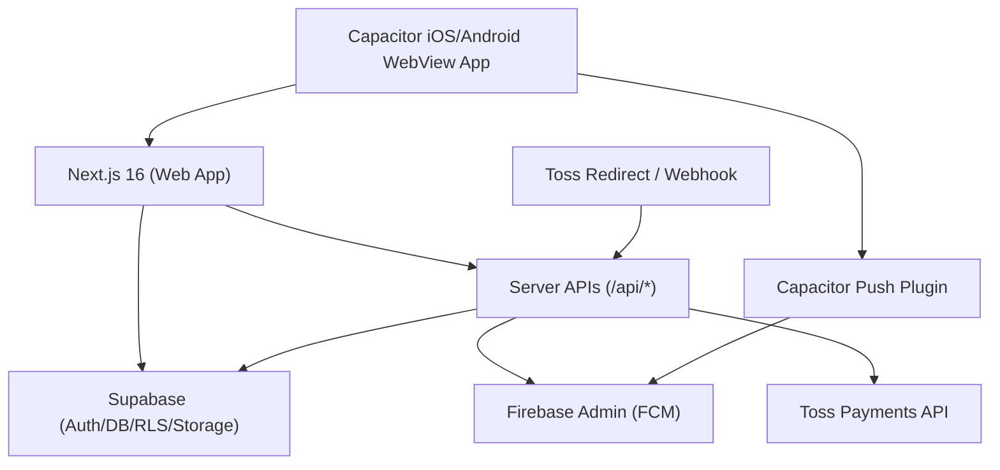

# ImFencer Mobile Commercial Release Guide

## 1) Architecture



- Web: Next.js App Router
- Mobile wrapper: Capacitor (`/mobile`)
- Push: FCM server SDK (`lib/push.ts`), iOS는 Firebase 콘솔의 APNs Key 연동 전제
- Payment: Toss Payments (prepare -> redirect -> confirm -> webhook)

## 2) DB SQL

- 신규 마이그레이션 파일: `migrations/20260216_mobile_release.sql`
- 포함 내용:
  - `platform_settings`
  - `account_deletions`
  - `payment_logs`
  - `push_logs`
  - `profiles` soft-delete 컬럼
  - `fencing_class_reservations` 결제 컬럼

실행:

```sql
-- Supabase SQL editor에서 실행
\i migrations/20260216_mobile_release.sql
```

## 3) Server Code (by file)

- 서비스 롤 클라이언트: `lib/supabase-admin.ts`
- 플랫폼 수수료 계산: `lib/platform-settings.ts`
- 푸시 발송/로그: `lib/push.ts`
- 알림+푸시 디스패처: `lib/notifications.ts`
- Toss helper: `lib/toss.ts`
- 계정삭제 API: `app/api/auth/delete-account/route.ts`
- OAuth 코드 교환 API: `app/api/auth/exchange-code/route.ts`
- 결제 API:
  - `app/api/payments/classes/[id]/prepare/route.ts`
  - `app/api/payments/toss/confirm/route.ts`
  - `app/api/payments/toss/fail/route.ts`
  - `app/api/payments/toss/webhook/route.ts`
- 관리자 수수료 API: `app/api/admin/platform-settings/route.ts`

이벤트 트리거(알림+푸시):
- 댓글: `app/api/posts/[id]/comments/route.ts`
- 채팅: `app/api/chats/start/route.ts`, `app/api/chats/[id]/messages/route.ts`
- 예약 상태: `app/api/fencing/class-reservations/[id]/route.ts`
- 레슨 신청/상태: `app/api/fencing/lessons/[id]/orders/route.ts`, `app/api/fencing/lesson-orders/[id]/route.ts`

## 4) Frontend Changes

- 계정삭제 UI: `components/profile/ProfileMenuButton.tsx`
- 결제 버튼: `components/fencing/ClassPaymentButton.tsx`
- 결제 성공/실패 페이지:
  - `app/payments/toss/success/page.tsx`
  - `app/payments/toss/fail/page.tsx`
- 관리자 수수료 UI:
  - `app/admin/platform-settings/page.tsx`
  - `components/admin/PlatformSettingsForm.tsx`
- 모바일 브릿지(푸시 등록/딥링크/OAuth 복귀):
  - `components/mobile/MobileBridge.tsx`
  - `app/layout.tsx`에 주입

## 5) Capacitor Config

- 모바일 프로젝트 루트: `mobile/`
- 설정 파일: `mobile/capacitor.config.ts`
- 생성된 네이티브 프로젝트:
  - `mobile/ios/`
  - `mobile/android/`
- 동기화:

```bash
cd mobile
npm install
npm run sync
```

## 6) iOS Settings

- URL Scheme: `imfencer` (Info.plist 반영됨)
  - 파일: `mobile/ios/App/App/Info.plist`
- Push:
  - Apple Developer에서 APNs Auth Key(.p8) 생성
  - Firebase Console > Cloud Messaging > iOS 앱에 APNs Key 업로드
  - Xcode에서 Push Notifications / Background Modes(remote notifications) 활성화
- Universal Links:
  - Associated Domains에 `applinks:imfencer.com` (필요 시 `applinks:www.imfencer.com`) 추가
  - 서버에 `apple-app-site-association` 배포

## 7) Android Settings

- 딥링크/앱링크 intent-filter 반영:
  - 파일: `mobile/android/app/src/main/AndroidManifest.xml`
- 푸시:
  - `mobile/android/app/google-services.json` 배치
  - Firebase 프로젝트와 package name(`com.imfencer.app`) 일치
- 권한:
  - `INTERNET`, `POST_NOTIFICATIONS`
- 프로가드:
  - 파일: `mobile/android/app/proguard-rules.pro`
- target sdk:
  - `mobile/android/variables.gradle` (`targetSdkVersion = 36`)

## 8) Release Procedure

### iOS (TestFlight -> App Store)

1. `cd mobile && npm run sync`
2. `npm run open:ios`
3. Xcode에서 Signing/Bundle ID/Capabilities 확인
4. Product > Archive
5. App Store Connect로 Upload -> TestFlight 배포
6. 심사 제출 전:
   - 계정삭제 경로: `마이 > 햄버거 메뉴 > 계정 삭제`
   - 개인정보 라벨 업데이트
   - 로그인 테스트 계정 준비

### Android (Play Console)

1. `cd mobile && npm run sync`
2. `npm run open:android`
3. Android Studio에서 Release signing keystore 설정
4. Build > Generate Signed Bundle/APK > AAB 생성
5. Play Console 업로드
6. Data Safety / 계정삭제 정책 문구 반영

## 9) Review Rejection Prevention Checklist

- 계정삭제 기능 앱 내 제공 (`/api/auth/delete-account` + UI)
- 회원가입/로그인/OAuth 정상 동작
- 결제 성공/실패/취소 처리 분기 존재
- 결제 검증 서버사이드 수행 (Toss confirm API)
- 웹훅 보안 검증(`TOSS_WEBHOOK_SECRET` 기반)
- 푸시 동의/거부 시 앱 크래시 없음
- 딥링크 클릭 시 대상 화면 이동
- 개인정보처리방침/이용약관 링크 명시 (`/legal/privacy`, `/legal/terms`)
- 테스트 계정 및 심사용 가이드 제공

## 10) Operator Manual

### Environment Variables

필수 키는 `.env.local.example` 참고:
- Supabase: `NEXT_PUBLIC_SUPABASE_URL`, `NEXT_PUBLIC_SUPABASE_PUBLISHABLE_KEY`, `SUPABASE_SERVICE_ROLE_KEY`
- Firebase: `FIREBASE_SERVICE_ACCOUNT_JSON` 또는 분리 키 3종
- Toss: `TOSS_CLIENT_KEY`, `TOSS_SECRET_KEY`, `TOSS_WEBHOOK_SECRET`
- App: `NEXT_PUBLIC_APP_URL`, `NEXT_PUBLIC_APP_SCHEME`
- Test login flag: `ENABLE_TEST_LOGIN=0`, `NEXT_PUBLIC_ENABLE_TEST_LOGIN=0` (기본 비활성화)

### Daily Ops

1. 결제 모니터링: `payment_logs`
2. 푸시 모니터링: `push_logs`
3. 탈퇴 이력 확인: `account_deletions`
4. 수수료 조정: `/admin/platform-settings`

### Incident Handling

- 결제 실패 급증:
  - `payment_logs.failure_code`, `failure_message` 점검
  - Toss 콘솔 웹훅 전달 상태 확인
- 푸시 실패 급증:
  - `push_logs.error_message` 확인
  - Firebase 서비스 계정 및 APNs 키 만료 확인
- OAuth 복귀 실패:
  - Supabase Redirect URL에 `imfencer://auth/callback` 등록 여부 확인
  - iOS URL Schemes / Android intent-filter 확인
